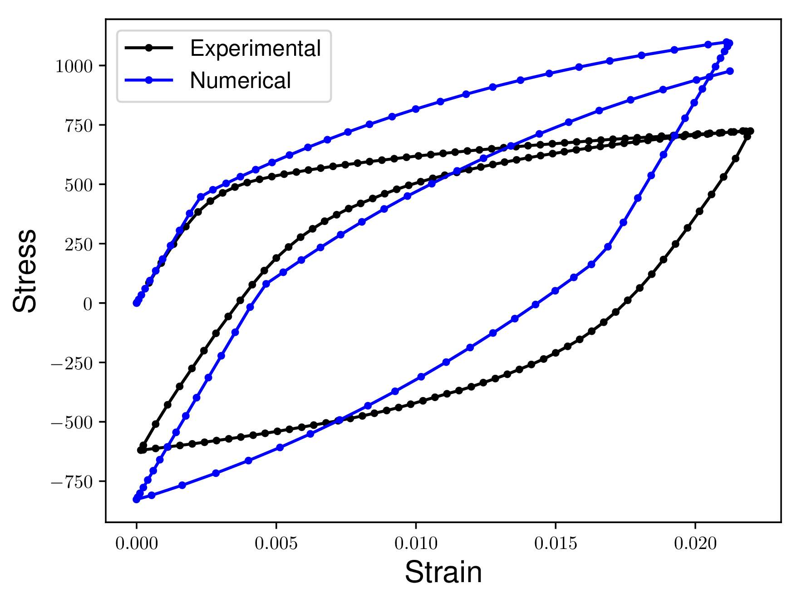

# Quantify the difference between two arbitrary curves

Curves in this case are:
- discretized by inidviudal data points
- are ordered from a beginning to an ending

The qua

# Methods covered
- **Partial Curve Mapping** (PCM) method: matches the area of a subset between the two curves
- **Area method**: An algorithm for calculating the Area between two curves in 2D space
- **Discrete Fréchet distance**: The shortest distance in-between two curves, where you are allowed to very the speed at which you travel along each curve independently (walking dog problem)
- Dynamic Time Warping (DTW)
- Curve Length method (uses the arc-length of each curve as the independent variable)

# Example
In the ideal case the Numerical curve would match the Experimental curve exactly. This means that the two curves would appear directly on top of each other. Our measures of similarity would return a *zero* distance between the two curves.

Consider the following two curves. We want to quantify how different the Numerical curve is from the Experimental curve. Notice how there are no concurrent Stress or Strain values in the two curves. Additionally one curve has more data points than the other curves.

# References

# Please cite
If you've found this information helpful, please cite

SOON_TM
